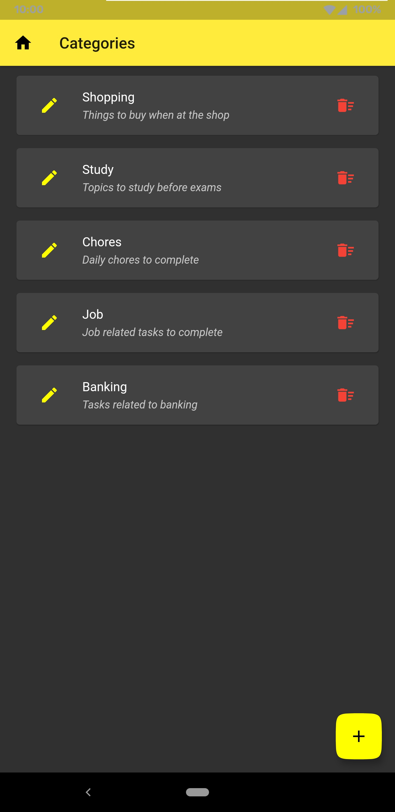

# ToDoList-App
A simple yet elegant to-do listing app made using Flutter and Sqflite.

## Built with
- [Flutter](https://flutter.dev/)
- [sqflite 1.3.1](https://pub.dev/packages/sqflite)
- [intl 0.16.1](https://pub.dev/packages/intl)
- [Android Studio](https://developer.android.com/studio)

### Note : There are some basic features missing from the app, I am still working on this, and is nowhere near done.

## ScreenShots
|First Page|Select Page|Country without Charts|Country with Charts|
|:------------:|:------------:|:-------------:|:-------------:|

